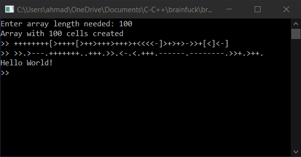

# Brainfuck Interpreter

Brain fuch is an esoteric language, though, it is Turing complete.

The original brainfuck language has 8 instructions only:

* `+` increments current cell. `curentCell++`
* `-` decrements current cell. `currentCell--`
* `>` moves the pointer to the right, or increments its position. `pointerPos++`
* `<` moves the pointer to the left, or decrements its position. `pointerPos--`
* `,` stores one byte of input in the current cell. `cin >> curentCell`
* `.` outputs the value of the current cell as an ascii char. `printf("%c", currentCell)`
* `[` executes after bracket if current cell is not zero, otherwise it jumps to the closing bracket. `if(currentCell != 0){executeLoop()}`
* `]` jumps back to opening bracket if the current cell is not zero, otherwise it exits the loop. `if(currentCell != 0){executeLoop()}`

all of those instructions are implemented in the interpreter, but I added a couple more for more functionality:

* `*` exits the interpreter
* `&` prints the current pointer position. `cout << pointerPos`
* `;` this one outputs the value of the current cell as a numeric value. `cout << currentCell`

## Example programs:



### Hello world

```
++++++++
[>++++[>++>+++>+++>+<<<<-]>+>+>->>+[<]<-]
>>.>---.+++++++..+++.>>.<-.<.+++.------.--------.>>+.>++.
```

### Printing cell capacity

Copied from [Esolangs](https://esolangs.org/wiki/Brainfuck#Cell_Size)

```
Calculate the value 256 and test if it's zero
If the interpreter errors on overflow this is where it'll happen
++++++++[>++++++++<-]>[<++++>-]+<[>-<
    Not zero so multiply by 256 again to get 65536
    [>++++<-]>[<++++++++>-]<[>++++++++<-]+>[>
        # Print "32"
        ++++++++++[>+++++<-]>+.-.[-]<<[-]<->] <[>>
        # Print "16"
        +++++++[>+++++++<-]>.+++++.[-]<<<-]] >[>
        # Print "8"
        ++++++++[>+++++++<-]>.[-]<<-]<
# Print " bit cells\n"
+++++++++++[>+++>+++++++++>+++++++++>+<<<<-]
>-.>-.+++++++.+++++++++++.<.>>.++.+++++++..<-.>>-
Clean up used cells.
[[-]<]
```